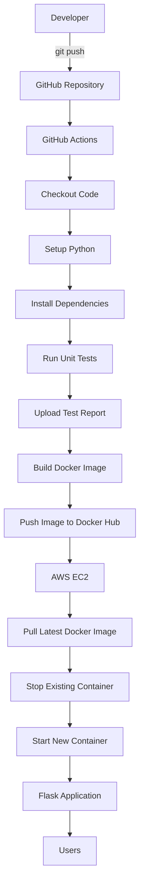

# Enterprise CI/CD Pipeline using GitHub Actions, Docker & AWS

## 📌 Project Overview

This project demonstrates an end-to-end CI/CD pipeline for a Python Flask application using GitHub Actions, Docker, Docker Hub, and AWS EC2.

The pipeline automatically:

- Builds the application
- Runs unit tests
- Generates test reports
- Builds a Docker image
- Pushes the image to Docker Hub
- Deploys the latest version to AWS EC2

---

## 🏗️ Architecture



## 🚀 Features

- CI/CD with GitHub Actions
- Dockerized Flask application
- Automated testing using Pytest
- Docker Hub integration
- Automated deployment to AWS EC2
- Secure credential management using GitHub Secrets
- Dependency caching for faster builds
- Test report artifact generation

---

## 🛠 Tech Stack

- Python
- Flask
- Pytest
- GitHub Actions
- Docker
- Docker Hub
- AWS EC2
- Ubuntu
- Git

---

## 📂 Project Structure

```text
enterprise-ci-cd-pipeline/
│
├── app/
│   ├── app.py
│   ├── calculator.py
│   └── __init__.py
│
├── tests/
│   └── test_calculator.py
│
├── .github/
│   └── workflows/
│       └── ci.yml
│
├── Dockerfile
├── requirements.txt
├── .gitignore
└── README.md
```

---

## ⚙️ CI/CD Workflow

1. Developer pushes code to GitHub
2. GitHub Actions workflow starts
3. Python environment is created
4. Dependencies are installed
5. Unit tests are executed
6. Test report is uploaded
7. Docker image is built
8. Docker image is pushed to Docker Hub
9. AWS EC2 pulls the latest image
10. Existing container is replaced with the latest version

---

## 🔐 GitHub Secrets Used

- DOCKER_USERNAME
- DOCKER_PASSWORD
- EC2_HOST
- EC2_USERNAME
- EC2_SSH_KEY

---

## 🐳 Docker Commands Used

```bash
docker build -t enterprise-ci-cd .
docker run -p 5000:5000 enterprise-ci-cd
docker push <dockerhub-username>/enterprise-ci-cd
```

---

## ☁️ AWS Deployment

The application is deployed on:

- AWS EC2 (Ubuntu)
- Docker Container
- Publicly accessible using EC2 Public IP

---

## 📈 Future Improvements

- Kubernetes Deployment
- Terraform Infrastructure
- Nginx Reverse Proxy
- HTTPS using Let's Encrypt
- Monitoring with Prometheus & Grafana
- SonarQube Integration
- Trivy Image Scanning

---

## 👨‍💻 Author

**Vinay Malyala**

GitHub: https://github.com/2003vinay